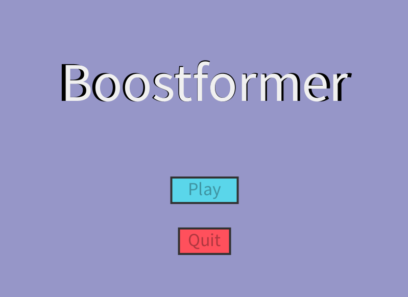
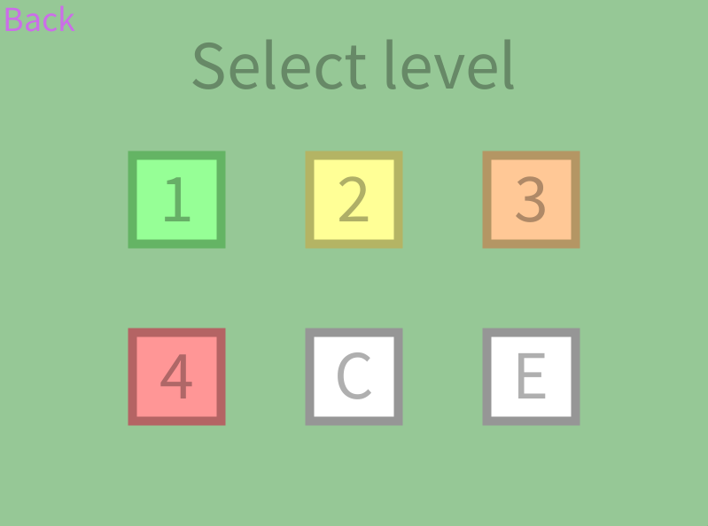
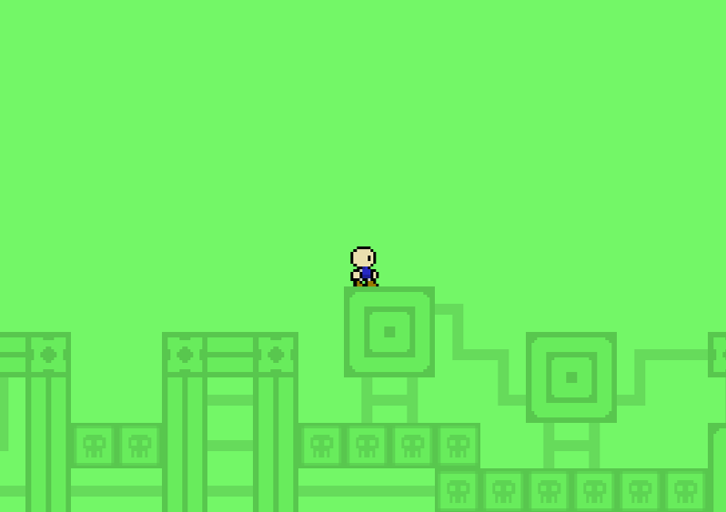
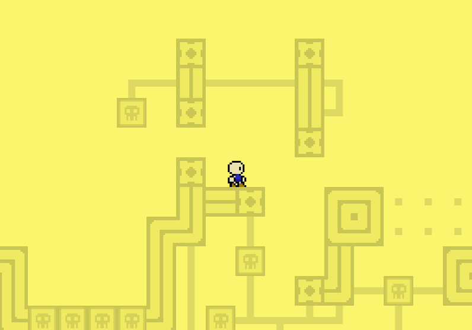
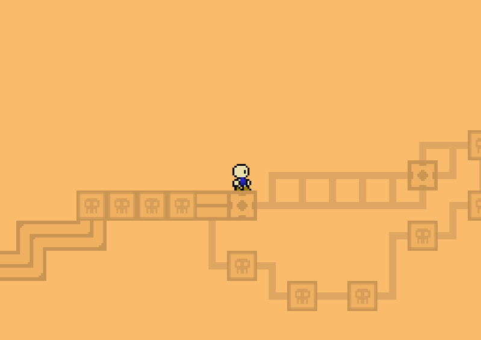
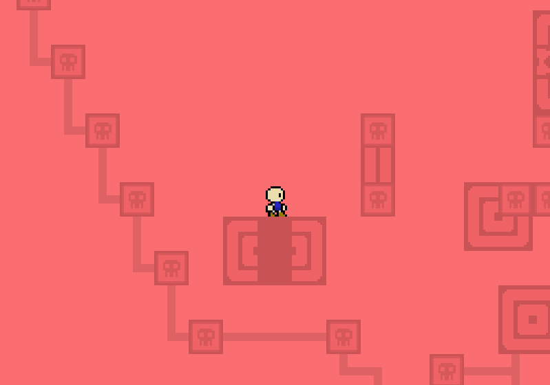
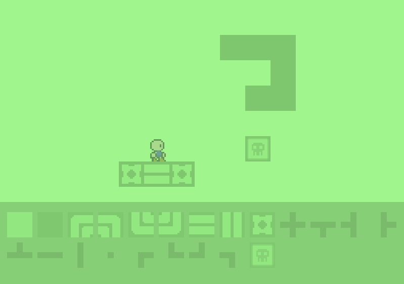

# Boostformer
A 2d platformer game made in Processing v4.1.3

# Controls
Move with A and D, jump with space, boost towards the mouse with left mouse button.

# Screenshots
Main menu

Level select

Levels

Level editor
